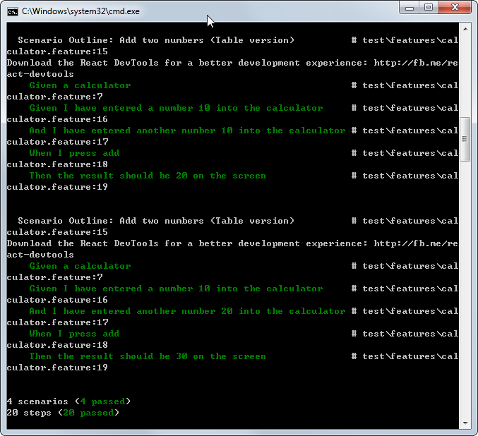

BDD-in-React
============
An example app showing how to apply BDD workflow for an ReactJS web application.

Environment Setup
-----------------
```
$ git clone https://github.com/LittleLin/BDD-in-ReactJS.git
$ cd BDD-in-ReactJS
$ npm install --dev
$ npm install -g cucumber
$ npm install -g protractor 
$ npm install -g webdriver-manager 
$ webdriver-manager update --standalone
```

Start testing server
--------------------
```
$ webdriver-manager start
```

Start app server
--------------------
```
$ npm start
```

Run cucumber features
--------------------
```
$ npm test
```

You should see the output like this:


